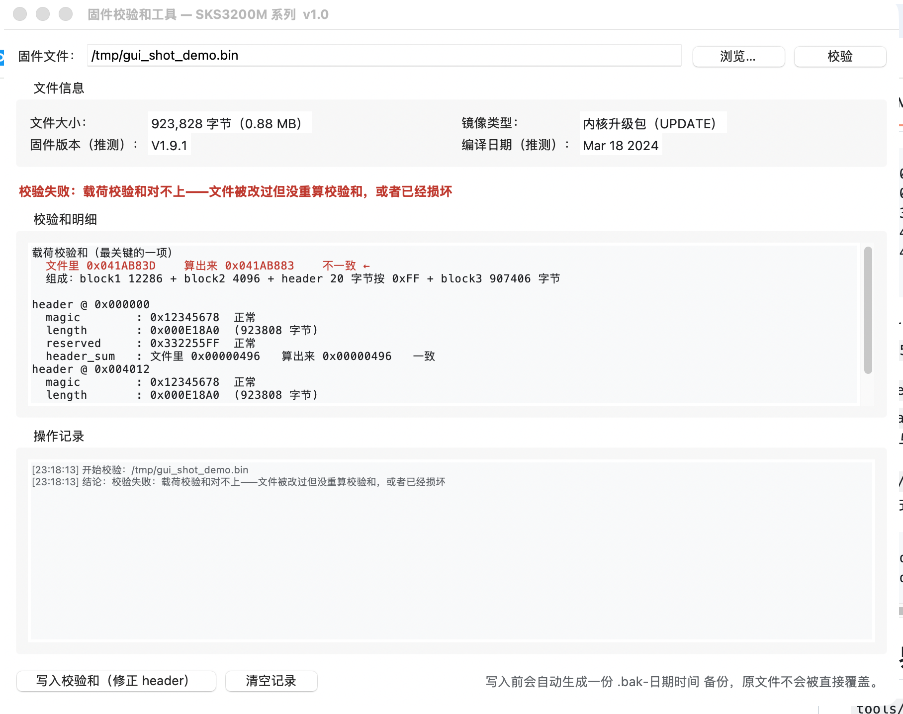
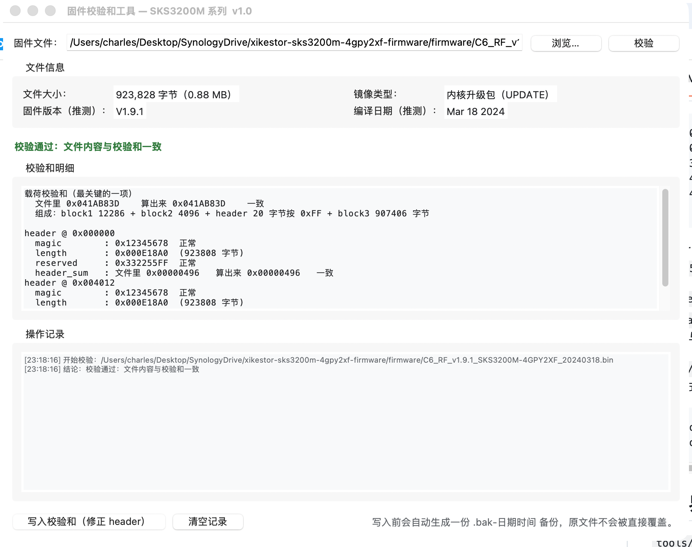

# 兮克 XikeStor SKS3200M-4GPY2XF 固件 / 整片 Flash 备份

兮克（XikeStor）**SKS3200M-4GPY2XF** 交换机的非官方固件归档。这台机器是无风扇、Web 轻管理二层交换机：
**4 个 2.5G 电口 + 2 个 SFP+ 万兆光口**。

硬件：Realtek **RTL8373** 交换芯片，RTL8226B / RTL8221B 2.5G PHY，管理固件跑在片内 **8051** 上
（Keil C51 编译，镜像约 900 KB，带 bank 切换）。

本仓库的用途只有一个：**让持有这台机器的人能救砖、能恢复出厂固件**。
二进制文件版权归原厂所有，见文末「版权声明」。

## 目录结构

```
firmware/
  SKS3200M-4GPY2XF_v1.9_full-flash_2MB.bin              2 MB 整片 Flash 镜像（恢复 / 救砖用）
  C6_RF_v1.9.1_SKS3200M-4GPY2XF_20240318.bin            官方升级包，V1.9.1
  C6_RF_v1.9.1_SKS3200M-4GPY2XF_20240318_patched.bin    同一个升级包，手工改了 1 个操作码字节
tools/
  calcsum.py                                            镜像头和载荷的校验和：验证 / 回写（命令行版）
  calcsum_gui.py                                        同一个功能的图形界面版，只用 Python 自带库，双击即用
  run_windows.bat                                       Windows 上双击打开图形界面
  build_windows_exe.bat                                 Windows 上把它打包成独立 exe（对方不用装 Python）
docs/
  firmware-analysis.md                                  完整分析（设备识别、镜像格式、校验和、flash 地图、改动字节）
  web-ui-and-loader-notes.md                            loader 菜单、uboot 密码提示、cgi 接口表、功能清单、SDK 源码路径
  factory-web-logo.png                                  从 flash 里抠出来的出厂 web logo
screenshots/
  hex-edit-0xC4418.png                                  十六进制编辑器截图，显示被改的那个字节
  gui-check-failed.png                                  图形界面版：校验失败的界面
  gui-check-ok.png                                      图形界面版：校验通过的界面
checksums.sha256
```

## 文件与校验值

| 文件 | 大小（字节） | SHA256 |
|---|---|---|
| `firmware/SKS3200M-4GPY2XF_v1.9_full-flash_2MB.bin` | 2,097,152 | `108a560aa4cd18a66b7dadf4f95d770e4d1b4fa6d6f7d343b67a61f70e50bacf` |
| `firmware/C6_RF_v1.9.1_SKS3200M-4GPY2XF_20240318.bin` | 923,828 | `f581617c35768285aca21a83064a757fc4fbcb16be7ea38f440f913a70552ad1` |
| `firmware/C6_RF_v1.9.1_SKS3200M-4GPY2XF_20240318_patched.bin` | 923,828 | `e0a6b694015548256b5b55c92c0801d2ec017930da260d3ebf4ad23c89dc9606` |
| `tools/calcsum.py` | 4,829 | `4effa9105ae6409b7d550054da9507a7e4a60d8c40f500a72c92a53d9f9bfbb2` |
| `tools/calcsum_gui.py` | 24,190 | `8e5135f5aa5a4590fc2db478311c3591f822262555cba3b18a2639dc9bcb10b7` | `a37e269432e7ebd3f7b3518b9f8cadf526fa877717234647a360c4490aab964c` | `8665d6ecdad5a6345b3caf7045ca47727279e82a1bf859761d0814ba29a39ecc` | `c5f4369a96b783a25f857220be6ecc29fe637f852ac58e9430a110270f026544` |
| `tools/run_windows.bat` | 795 | `5f163a07df6ae805aa434d9b03b31b5e77b283c96f75e9e04815fc00df10b9fa` |
| `tools/build_windows_exe.bat` | 1,193 | `aa5d8145d76a88f4d89d6d305b8ada66c2dcc61b3926cc3e6f5297e136908763` |

MD5：整片 dump `fd83d22ad7d919c6507bbe6b0f17389c`，
官方升级包 `c2e7bdb2a5b4e7da27d2ac143a60b320`，
被改过的升级包 `8ccd59d8e78e0f43ba244bbbe4d8dff7`。

校验方式：

```bash
shasum -a 256 -c checksums.sha256
```

## 版本对照

| 镜像 | 固件版本 | 编译日期 |
|---|---|---|
| 整片 Flash dump | **V1.9** | 2024-01-03 |
| 官方升级包 | **V1.9.1** | 2024-03-18 |

两点必须说清楚：

* dump 里**找不到** V1.9.1、也找不到 2024-03-18 这个日期，所以它**不是**升级包的一份拷贝，是更早的出厂固件。
* dump 是**整片 Flash**（loader + 内核 + 出厂 logo + 出厂参数区），**能整片写回、能救砖**；
  两个 `.bin` 是**只含内核**的升级包，刷进去**不动** loader、logo 和参数区。**两者不能互相替代。**

整片恢复之后的出厂状态：`http://192.168.10.12`，掩码 `255.255.255.0`，网关 `192.168.10.1`，
账号 `admin`，密码 `admin`。

（Flash 里存的是 `MD5("admin"+"admin")` = `f6fdffe48c908deb0f4c3bd36c032e72`，
这个哈希在固件内部也是同一个值——是**出厂默认**，不是谁设的私人密码。）

## 升级包（.bin）的格式

```
0x000000   20 字节       header #1
0x000014   0x2FFE        block1
0x003012   0x1000        block2
0x004012   20 字节       header #2（header #1 的副本）
0x004026   907,404 字节  block3（主体）
                        payload = 923,808 字节 = header.length（0x000E18A0）
```

header 是 5 个**大端** uint32：`magic 0x12345678`、`length`、`header_sum`、`payload_sum`、
`reserved 0x332255FF`。

* `header_sum` = 20 字节头里，把 `header_sum` 字段本身清零后的逐字节累加；
* `payload_sum` = `block1 + block2 + 0xFF x 20 + block3` 逐字节累加。
  header 所在那 20 字节按空白 `0xFF` 参与计算，也就是说**校验和是先算好、再把 header 盖上去的**。

`tools/calcsum.py` 是公开的第三方工具（"SWTG Firmware Checksum Calculator"，**不是本仓库作者写的**），
能校验这套格式，也能回写校验和。**不带 `-u` 它绝不写文件**：

```bash
python3 tools/calcsum.py firmware/C6_RF_v1.9.1_SKS3200M-4GPY2XF_20240318.bin    # 只校验
python3 tools/calcsum.py -u firmware/....bin                                     # 校验并回写校验和
```

## 图形界面版（给不想用命令行的朋友）

界面长这样（左边是文件被改坏、校验不通过；右边是正常的官方升级包）：

| 校验失败 | 校验通过 |
|---|---|
|  |  |

`tools/calcsum_gui.py` 是同一个校验和工具的图形界面，**只用 Python 自带的 tkinter，不需要 pip 装任何东西**，
单文件、双击就能开（Windows / macOS / Linux 都一样）：

* 点「浏览…」选固件文件，自动开始校验；
* 结论直接用颜色表示：绿色「校验通过」、红色「校验失败」、橙色「无法识别」；
* 把 header 里存的值和算出来的值并排列出来（magic / length / header_sum / payload_sum），
  哪一项对不上一眼就能看到；
* 文件被改过（比如刷了修改版但忘了重算校验和）时，点「写入校验和」即可修正：
  **写入前自动生成 `.bak-日期时间` 备份，原文件不会被直接覆盖**，写完还会自动重新校验一遍；
* 顺便显示推测的固件版本和编译日期，用来分辨手里的文件是 V1.9 还是 V1.9.1。

怎么用：

* 装了 Python 3 的机器：直接双击 `tools/calcsum_gui.py`（Windows 上也可以双击 `tools/run_windows.bat`）；
* 对方连 Python 都没装：在**任意一台 Windows 机器**上双击 `tools/build_windows_exe.bat`，
  会在 `dist\` 里生成一个独立的 `FirmwareChecksum.exe`（Python 运行时已经打包进去，对方双击就能用）。
  PyInstaller 不能跨平台打包，所以 Windows 的 exe 只能在 Windows 上打。
* 连打包都懒得做：直接到本仓库的 **Releases** 页面下载 `FirmwareChecksum.exe`——
  那是 GitHub 的 Windows 机器自动打好的，双击就能用，不需要装 Python。
  （用的是 `.github/workflows/build-windows-exe.yml`；推一个 `v*` 标签就会自动出新版本。）

两个版本的算法是同一套，实测把同一个改坏的文件分别用命令行版和图形界面版修正，产出的文件**逐字节相同**。

想确认这个工具本身没坏，可以跑一次无界面自检（不开窗口，只造两个假镜像，验证「校验 → 发现被改坏 → 回写 → 重新通过」这条路）：

```bash
python3 tools/calcsum_gui.py --selftest
```

Windows 版的 exe 每次发布前，GitHub 的 Windows 机器上也会自动跑一遍这个自检。

## Flash 布局（2 MB FM25Q16）

这张图是实测出来的：拿整片 dump 和官方升级包在三个锚点交叉比对，再用 `calcsum.py` 验证 dump 的载荷校验和
（能对上，说明布局判断正确）。

```
0x000000 - 0x001002   loader（4 KB）：SPI FLASH VIEWER 菜单、uboot 风格密码提示
0x001002 - 0x004000   内核 block1（0x2FFE）        <- 对应 .bin 的 0x0014
0x004000 - 0x01C000   约 96 KB 代码区：升级包里没有、也不参与校验（用途未查清）
0x01C000 - 0x01D000   内核 block2（0x1000）        <- 对应 .bin 的 0x3012
0x01D000 - 0x01D014   内核 header（20 字节）       <- 对应 .bin 的 0x4012
0x01D014 - 0x0FA8A0   内核 block3（主体）          <- 对应 .bin 的 0x4026
0x0FA8A0 - 0x100000   镜像尾部残留（含一段 WebKit multipart 边界串，是上传文件留下的）
0x100000 - 0x1F9008   空白（全 0xFF）
0x1F9008 - 0x1FA389   出厂 web logo：4 字节长度 0x1377 + PNG（190x65 品牌 logo）
0x1FD000 - 0x1FD240   出厂默认参数（型号、硬件版本 V1.0、IP/掩码/网关、账号、口令哈希）
0x1FD14C - 0x1FD1FF   Web 配色表（#F2F2F3 #000000 #DCDCDC #173267 ...）
0x1FE000 - 0x1FEA42   运行配置 nvcfg（端口属性、链路聚合、计数等）
0x1FEA42 - 0x200000   空白（全 0xFF）
```

细节、从字符串里整理出的功能清单、校验和算法的推导，都在 `docs/firmware-analysis.md`。

## 那 1 个字节的改动

`..._patched.bin` 和官方包只差 5 个字节：4 个是校验和字段，第 5 个是 `0xC4418` 上的一个操作码
（`0x60` 改成 `0x80`）：

```asm
0xC4414  12 2C D5     lcall 0x2CD5
0xC4417  EF           mov   a, r7
0xC4418  60 2A        jz    0x4444      ; 官方包 / 出厂 dump 都是 JZ = 0x60
0xC4418  80 2A        sjmp  0x4444      ; 改过的：SJMP = 0x80
0xC4444  22           ret
```

原厂逻辑是「被调用函数返回 0 才跳过这一小段」；改成 `SJMP` 之后变成「**无条件跳过**」，
也就是把 `0xC441A - 0xC4443` 那段（清 XRAM 0x8096 → 调子程序 → 读 XRAM 0x8091 的 bit0 →
以 DPTR=0x871F 调 0x26C6 → 打印 → 调 0x51ED）**整段禁用**，函数直接返回。

`0x60` 在官方包和出厂 dump（`0xDD405`）里都是原值，所以这是**人为改动**，不是版本差异。

注意：8051 跑的是 bank 切换的代码，**代码地址不等于文件偏移**，所以 `lcall` 的目标不能直接当文件偏移来跟。

## 恢复 / 救砖步骤

1. 只用 **3.3 V** 的编程器（CH341A + FM25Q16，SOP-8 夹子或拆焊）。
2. 写之前**先读两遍、两遍对比一致**，确认读到的就是芯片内容。
3. 写入 `SKS3200M-4GPY2XF_v1.9_full-flash_2MB.bin`，写完做一次校验。
4. 第一次上电应该是上面那套出厂默认参数。

这些都是从**单台零售机**读出来的，不保证对你的板子版本一定适用。

## 来源

整片 Flash 是用 CH341A 编程器从一台零售机上读出来的（2026 年 2 月），
官方升级包来自厂商常规下载渠道。归档与整理：[@charleshuang13](https://github.com/charleshuang13)。

## 相关链接

* ServeTheHome 对本型号的评测（2024 年 5 月）：`xikestor-sks3200m-4gpy2xf-review-managed-4-port-2-5gbe-switch`
* 厂商说明书（SKS32 系列，适用本型号）：`SKS32Series_Web-Managed-Switch-Manual`

## 版权声明

本仓库里的固件二进制文件，版权归各自的版权方（Realtek 和/或 ODM 和/或兮克）所有。
它们仅被归档用于**持有该硬件的人自行维修与研究**。仓库对二进制文件**不声明任何许可**，
也**不提供**覆盖它们的 LICENSE 文件。`tools/calcsum.py` 是第三方公开代码；
`docs/` 下的文档是为本归档整理的。如果你是版权方并要求移除某个文件，请开 issue 说明。
